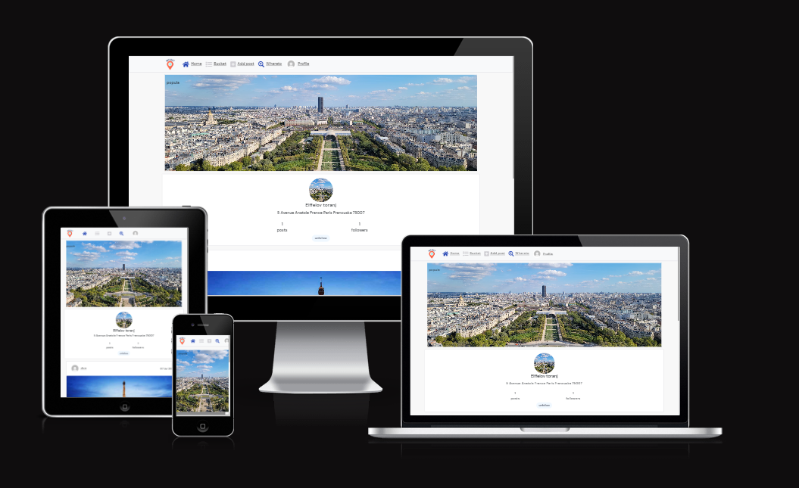
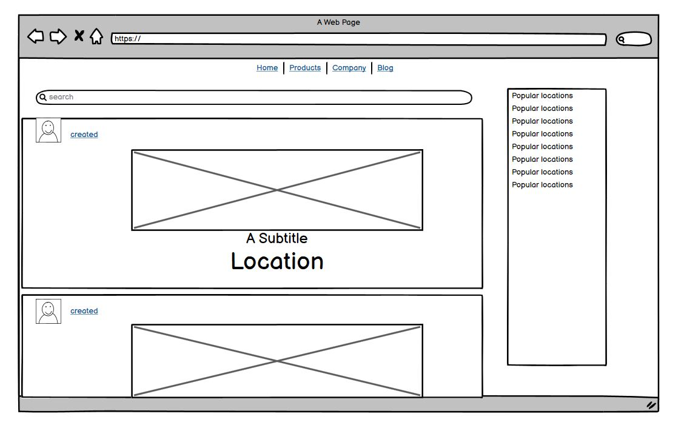
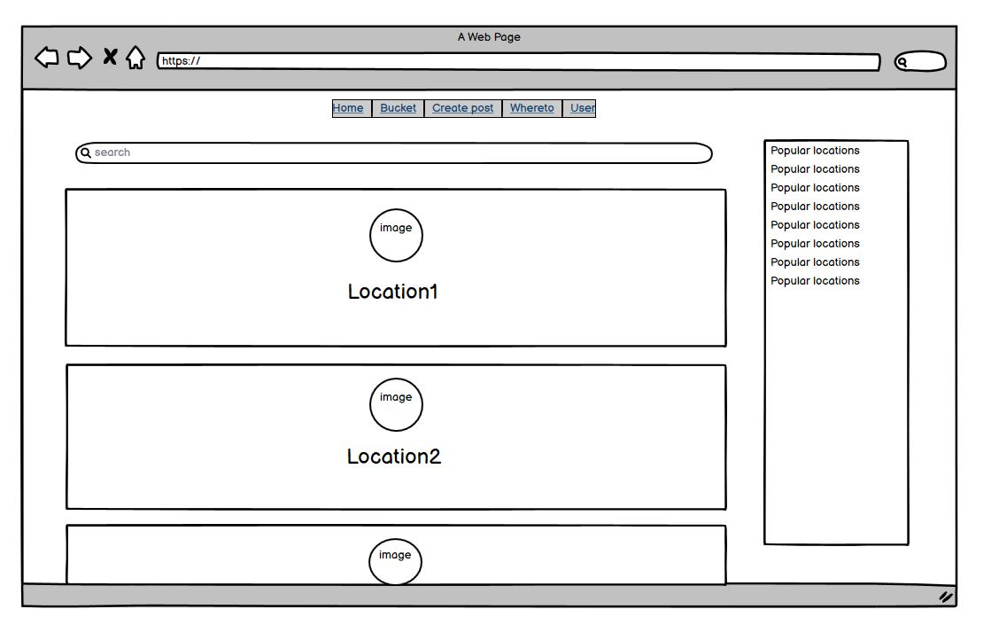
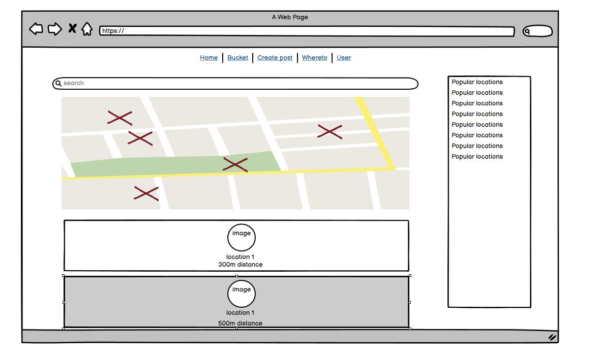
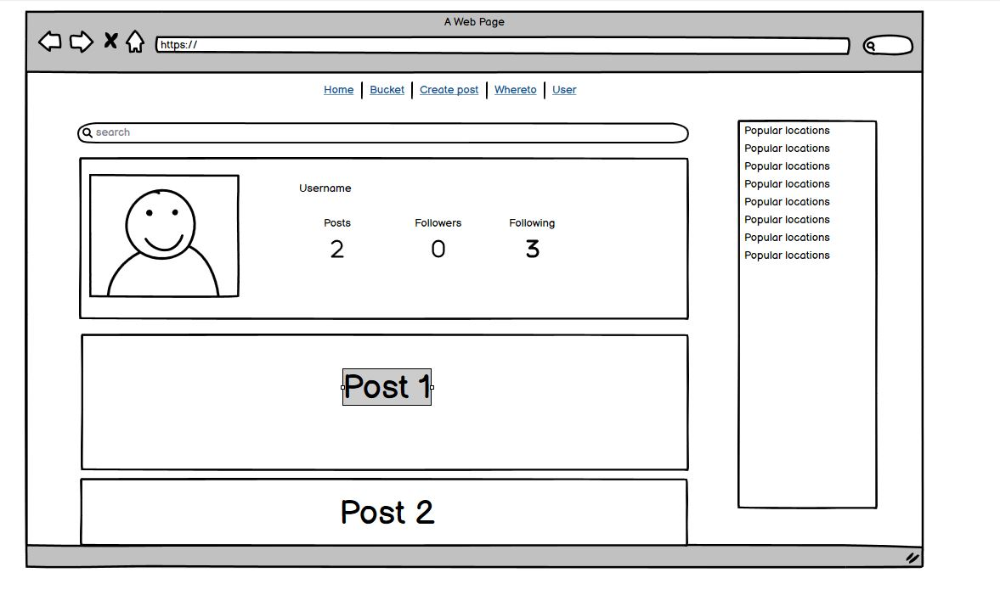

# Whereto

Whereto is a travel companion app that revolutionizes the way users explore new cities. With Whereto, travelers have a wealth of information at their fingertips to make their journeys more enjoyable and enriching. The app allows users to effortlessly discover recommendations from fellow travelers, immerse themselves in captivating user-generated posts, and curate their own personalized travel bucket lists.

Whether you're seeking hidden gems, popular attractions, or delightful dining experiences, Whereto provides valuable insights to help you make informed decisions. The app goes beyond traditional travel guides by fostering a vibrant community where users can connect, share their travel stories, and engage in discussions. From exhilarating adventures to cultural festivals, Whereto keeps users informed about events and promotions happening near them, even when they're at home.

Whereto empowers travelers to explore with confidence and discover the essence of each city they visit. With its intuitive interface and user-friendly features, the app becomes an indispensable companion that enhances every step of the travel experience. From planning to reminiscing, Whereto ensures that every journey is filled with memorable moments and extraordinary discoveries.


### how to use

Whereto is a dynamic travel companion app that allows users to create profiles, share posts, discover exciting locations, engage with others through likes and comments, and stay connected with the travel community. It offers a range of features designed to enhance the user experience and facilitate exploration.

Upon creating an account and logging in, users can create their profiles, storing their information securely in the app's database. With their profile set up, users can dive into the world of travel and start sharing their experiences through posts. When creating a post, the location is automatically detected and associated with the content, providing context to other users.

The app's home page serves as a hub for users to discover posts from travelers worldwide. It showcases an array of captivating content, including travel stories, recommendations, and insights shared by fellow users. This immersive feed allows users to stay inspired, gain valuable travel information, and connect with others who share their passion for exploration.

To foster connections within the community, Whereto enables users to follow other users or specific locations of interest. By following people, users can stay updated on their latest posts, recommendations, and travel experiences. Similarly, following locations allows users to receive updates on popular places, upcoming events, and promotions.

Engagement is encouraged through likes and comments. Users can express appreciation for posts by liking them and leave thoughtful comments to spark conversations and provide feedback. This interaction creates a sense of camaraderie and encourages a supportive community where users can learn from one another and share their perspectives.

In addition to user-generated content, Whereto provides a comprehensive view of locations near the user. Users can easily explore places of interest, see their popularity based on likes and comments, and discover any popular events happening nearby. This feature enables users to stay informed about local activities, ensuring they make the most of their travel experiences.

Whereto empowers travelers to document their journeys, connect with like-minded individuals, and uncover hidden gems worldwide. With its intuitive interface, personalized content, and engagement-focused features, the app creates a vibrant and immersive travel community. Whether users seek inspiration, practical recommendations, or connections with fellow explorers, Whereto is the ultimate companion for their travel adventures.



### User Stories

Whereto aims to elevate users' awareness of their surroundings and enhance their travel experiences. With Whereto, users can effortlessly explore nearby locations, discover the culinary delights they offer, uncover hidden gems, and stay updated on promotions and events. The app provides a convenient platform to browse through a wide range of places located near the user, offering insights into the number of visitors, comments, and other users' experiences. By following desired locations, users can easily stay connected and receive updates about their favorite spots. Whereto makes it simple for users to engage with their surroundings, find new places to explore, and immerse themselves in the vibrant offerings of their local communities.


## Features

1. Discover Nearby Locations: Users can explore and discover nearby locations based on their current location or specified area, allowing them to find exciting places to visit.

2. Detailed Location Information: Users can view detailed information about each location, including addresses, contact details, and descriptions, to help them plan their visits.

3. Restaurant and Food Insights: Users can access information about the types of food served at each location, such as cuisine, menus, and specialties, enabling them to make informed dining choices.

4. Hidden Gems and Secret Locations: Whereto showcases lesser-known or hidden locations, revealing unique spots that users may not be aware of, enhancing their sense of adventure and discovery.

5. Promotions and Events: Users can stay up to date with promotions, special offers, and events happening at various locations, ensuring they don't miss out on exciting opportunities.

6. User Interactions: Users can engage with posts by liking them, allowing them to express their appreciation for the content shared by other users.

7. Profile Customization: Users can update their profile pictures to personalize their profiles and reflect their unique identities within the Whereto community.

8. View Other Profiles and Posts: Users can browse and view profiles of other users, as well as explore their posts, gaining insights and inspiration from fellow travelers' experiences.

9. Address Lookup: Users can easily access the addresses of locations they are interested in, simplifying navigation and planning for their visits.

10. Follow Desired Locations: Users can choose to follow specific locations, enabling them to receive updates, notifications, and recommendations related to those places.


### General features on each page

1. Home Page:

- View a feed of posts from various users, showcasing travel stories, recommendations, and insights.
- Engage with posts by liking, commenting, and sharing.
- Discover popular and trending posts from users worldwide.

2. Bucket Page:

- Access a personalized bucket list of locations or places users want to visit or explore.
- Add new locations to the bucket list.
- Remove locations from the bucket list once visited or if no longer of interest.
- Easily prioritize and track the progress of visiting locations.

3. Post Page:

- Create and share travel-related posts, including stories, tips, and recommendations.
- Include details such as title, content, images, and location information.
- Edit or delete existing posts.
- Engage with other users' posts through likes, comments, and sharing.

4. Nearby Locations Page:

- View a list of locations near the user's current location or specified area.
- Access detailed information about each location, including addresses, contact details, and descriptions.
- Discover popular or highly rated locations based on user interactions and feedback.

5. Profile Page:

- View and edit user profile details, including name, bio, profile picture, and other information.
- See a collection of the user's own posts, allowing others to explore their travel experiences.
- View the number of followers and the users or locations the profile is following.
- Customize profile settings and preferences.
- Log out from the app to ensure account security.


### Future Implementations

1. Chat Feature: Introduce a chat functionality that allows users to communicate with each other, facilitating discussions, sharing travel tips, and fostering connections within the Whereto community.

2. Proximity Notifications: Implement proximity-based notifications for locations on a user's bucket list. Users would receive notifications when they are near a location they have added to their bucket list, providing reminders or special offers related to that place.

3. Location Engagement Summary: Display a summary of likes and comments received on location pages. This feature would allow users to get an overview of the engagement and popularity of a particular location, encouraging exploration and interaction.

4. Location Sharing: Enable users to share their current location with others, providing a way to let friends or followers know where they are and share interesting experiences or recommendations related to that specific location.

5. Explore Recommendations: Enhance the explore functionality by providing personalized recommendations based on user preferences, past activity, and popular trends, helping users discover new and relevant locations to visit.

6. Bookmarking: Allow users to bookmark posts or locations they find interesting or want to revisit later, providing a convenient way to save and organize content for future reference.

7. Social Media Integration: Integrate the app with popular social media platforms, enabling users to easily share their posts or favorite locations on their social media profiles, expanding the reach and visibility of Whereto content.

8. User-Generated Guides: Introduce a feature that allows users to create and share their own travel guides or itineraries, providing valuable insights and recommendations for specific destinations.

### Accessibility

Implementing features such as screen reader compatibility, keyboard navigation, color contrast, scalable text, alternative text for images, clear focus indicators, captions/transcripts for multimedia content, intuitive navigation, effective error handling, and user feedback.

### Languages Used

HTML, JavaScript(React) and CSS were used to create this website.

### Reusable React components

Components that can be easily integrated into various parts of a React application, providing a consistent and efficient way to create user interfaces.

#### Asset

Spinners turning when aiting for component to load.

#### Avatar

User profile, on click we are taken on page of clicked profile.

#### MoreDpropDown

Dropdown to edit/delete posts or comments, also used to edit, delete or signout of own profile.

#### NotFound

Custom message displayed when a user navigates to a URL that doesn't correspond to any existing route or content in the application. 


### Frameworks, Libraries & Programs Used

Balsamiq - Used to create wireframes.










Git - For version control.

Github - To save and store the files for the website.

Bootstrap Version 4.6 - The framework for the website. Code for the navigation bar, carousel, cards and form were used and modified. Additional CSS styling was also implemented in style.css.

Google Fonts - To import the fonts used on the website.

Font Awesome - For the iconography on the website.

Google Dev Tools - To troubleshoot and test features, solve issues with responsiveness and styling.

[Favicon.io](https://favicon.io/) To create favicon.

[Am I Responsive?](http://ami.responsivedesign.is/) To show the website image on a range of devices.


### Testing

  I have manually tested this project by doing following:

  - Passed code throught PEP8 liner and confirmed there are no problems.
            
  - Given invalid inputs: strings when numbers are expected or out of bounds inputs

  - Tested in my local terminal and the code intitute Heroku terminal


`Whereto`

| Feature | Expected Outcome | Testing Performed | Result | Pass/Fail |
| --- | --- | --- | --- | --- |
| Remove Sign In/out if user signed in | Tigned in | Sign in / Sign out button should disappear | Sign in / Sign out button disappeared  | Pass |
| Create Profile | create Profile| Tryed to create profile | Profile created | Pass |
| Create Post| create post, upload image set location | Post displayed on page | Post created| Pass |
| Location suggestions | If user tryes to add location, google places are suggested | Typed one letter in locations form | Places suggested | Pass |
| Edit Post| Edit post, imagee, location | Displayed post sholud be changed | Post changed | Pass |
| Delete Post| Delete post | Post sholud not be displayed | Post is not displayed | Pass |
| Like Post | Like posts | Liked one selected post | Post is displaying red heart | Pass |
| Unlike Post | Unlike posts | Unliked one selected post | Post is not displaying red heart| Pass |
| Comment Post | Leave comment on post | Wrote comment | comment displayed | Pass |
| Home page | User can see all posts on homepage | Clicked on home | All posts displayed | Pass |
| Bucked page | Logged in user can see Bucket and on click list all followed posts | Log in adn click on bucket | Followed locations diyplayed | Pass |
| Edit Comment| Edit my comment | Displayed comment chould be changed | Comment changed | Pass |
| Delete Comment| Delete Comment | Comment sholud not be displayed | Comment is not displayed | Pass |
| Location created | On post creation location creates automaticly | Post created | Location created | Pass |
| Location profile | Goaing on location profile we see all related posts | Clicked on location | All relevant posts displayed | Pass |
| Follow user | Sellect user to follow | Follow displayed| Unfollow displayed | Pass |
| Unfollow user | Sellect followed user to unfollow | Follow disappeared | Follow displayed | Pass |
| Follow location| Sellect location to follow  | Follow displayed | Follow displaye | Pass |
| Whereto places | Whereto section shows near places with distances | Clicked to Whereto | Places and distances shown | Pass |


I confirmed that the form works: requires entries in every field, will only accept number in the inpput field, and the errors work properly.


### Frameworks, Libraries & Programs Used


Bootstrap and React are powerful tools that I utilized in my project. 


## Deployment

## Version Control

The site was created using the Gitpod editor and pushed to github to the remote repository ‘whereto-frontend’.

The following git commands were used throughout development to push code to the remote repo:

```git add .``` - This command was used to add the file(s) to the staging area before they are committed.

```git commit -m “commit message”``` - This command was used to commit changes to the local repository queue ready for the final step.

```git push``` - This command was used to push all committed code to the remote repository on github.

<hr>
<br>

## Heroku Deployment

The site was deployed to Heroku. The steps to deploy are as follows:

* Navigate to heroku and create an account
* Click the new button in the top right corner
* Select create new app
* Enter app name
* Select region and click create app
* Click the resources tab and search for Heroku Postgres
* Select hobby dev and continue
* Click the deploy tab
* Scroll down to Connect to GitHub/whereto-frontend and sign in / authorize when prompted
* In the search box, find the repositoy you want to deploy and click connect
* Scroll down to Manual deploy and choose the main branch
* Click deploy

<hr>
<br>

#### How to Fork

To fork the whereto-frontend repository:

1. Log in (or sign up) to Github.
2. Go to the repository for this project, whereto-frontend.
3. Click the Fork button in the top right corner.

#### How to Clone

To clone the whereto-frontend repository:

1. Log in (or sign up) to GitHub.
2. Go to the repository for this project, whereto-frontend.
3. Click on the code button, select whether you would like to clone with HTTPS, SSH or GitHub CLI and copy the link shown.
4. Open the terminal in your code editor and change the current working directory to the location you want to use for the cloned directory.
5. Type 'git clone' into the terminal and then paste the link you copied in step 3. Press enter.


## Bugs 

1. Location Markers Not Loading: Resolved an issue where location markers were not displaying on the map. Implemented the necessary fixes to ensure proper loading and rendering of location markers.

2. Get Locations: Fixed a bug that was preventing the retrieval of locations from the database. Implemented the necessary changes to ensure accurate and efficient retrieval of location data.

3. List Followed Locations: Resolved an issue with the listing of followed locations. Updated the logic to correctly display the locations that users are following, providing an accurate representation of their preferences.

4. Automatic Location Creation: Addressed a bug related to the automatic creation of locations. Implemented the necessary checks and validations to ensure that locations are created correctly and consistently.

5. Avoid Location Duplicates: Fixed an issue where duplicate locations were being created in the database. Implemented duplicate-checking mechanisms to prevent the creation of duplicate location entries.

6. Occasional Infinite Loop in Console: Identified and resolved an intermittent issue causing an infinite loop in the console output. Debugged the code and applied the appropriate fix to ensure that the loop is terminated correctly.


## Credits

- Stack Overflow (www.stackoverflow.com)
- YouTube tutorials (mention specific channels or creators)
- Various websites and online resources (mention specific websites or resources)
